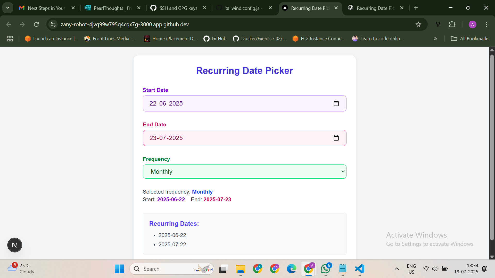

# 📅 Recurring Date Picker (React + Next.js + Tailwind CSS)

A reusable, user-friendly **Recurring Date Picker** component built with **Next.js**, **React**, and **Tailwind CSS**. It allows users to easily schedule recurring dates with options like Daily, Weekly, Monthly, and Yearly — inspired by the TickTick app.

---

## 🚀 Live Demo

[👉 Click here to view the live app][(Click here to view the live app) ](https://recurring-date-picker-v2.vercel.app
) 

---

## 📷 Screenshot

---

## 🔗 Cloud IDE (Gitpod)
Click below to open this project in a cloud browser-based editor:

👉 [Launch in Gitpod](https://gitpod.io/#https://github.com/archithaJ27/recurring-date-picker-v2)

---

Cloud IDE Link to Working Demo

https://gitpod.io/#<your-repo-link>

---
## 🔧 Tech Stack

- ✅ **Next.js 14**
- ✅ **React 18**
- ✅ **Tailwind CSS**
- ✅ **TypeScript**

---

## ✨ Features

- Select frequency: Daily / Weekly / Monthly / Yearly
- Choose specific days or dates based on frequency
- Dynamic UI updates based on selection
- Fully responsive and styled with Tailwind CSS
- Clean, reusable, and modular component

---

## 📁 Folder Structure

